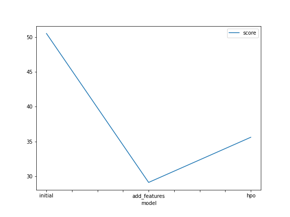
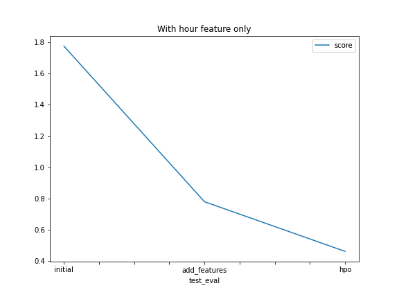
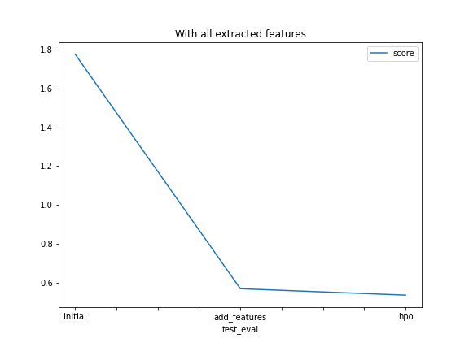

# Report: Predict Bike Sharing Demand with AutoGluon Solution
#### Omar Farouk

## Initial Training
### What did you realize when you tried to submit your predictions? What changes were needed to the output of the predictor to submit your results?
If the output contains negative values kaggle will not accept the submission, so we need to change negative values to 0.

### What was the top ranked model that performed?
The rop ranked model is Weighted Ensemble(Ensample Selection)

## Exploratory data analysis and feature creation
### What did the exploratory analysis find and how did you add additional features?
During exploratory data analysis phase, i found that i can extact month , day and hour into columns from the datetime column,which will give the model a good features to train the model on.
first I used hour column only without the month and day columns in training , then i train the model on all new features extracted from datetime column.
Also the season and weather columns are numerical datatype, but they are describe a categorical values, so we will change their type to 'categoy'.

### How much better did your model preform after adding additional features and why do you think that is?
adding the new features to the dataset really improved the score of models. Initial submission score is 1.775 and when the new features was added to the data, the score has been enhanced to be 0.779. It makes sense, of course the date specificaly the hour column will be very useful to predict the target value.

## Hyper parameter tuning
### How much better did your model preform after trying different hyper parameters?
Tuning Hyperparamters also improved the performance of the models. trying to adjust some Hyperparamters helped the model to score even better.

### If you were given more time with this dataset, where do you think you would spend more time?
I think there are more work could be done at Exploratory data analysis and feature creation. there are some of features are giving the same information or could be transformed into useful information, that could be used in the training to improve the perfromance.

### Create a table with the models you ran, the hyperparameters modified, and the kaggle score.
#### Scores when the hour column is added only
|model|hpo1|hpo2|hpo3|score|
|--|--|--|--|--|
|initial|default|default|default|1.77523|
|add_features|default|default|default|0.77945|
|hpo|GPM: num_leaves: lower=26,upper=66 num_boost_round: 100|NN: num_epochs: 10|num_trials = 5 searchstrategy= 'auto'|0.46172|

#### Scores when all extraccted columns(month, day, hour) are added
|model|hpo1|hpo2|hpo3|score|
|--|--|--|--|--|
|initial|default|default|default|1.77523|
|add_features|default|default|default|0.57067|
|hpo|GPM: num_leaves: lower=26,upper=66 num_boost_round: 100|NN: num_epochs: 10|num_trials = 5 searchstrategy= 'auto'|0.53766|

### Create a line plot showing the top model score for the three (or more) training runs during the project.

### Create a line plot showing the top kaggle score for the three (or more) prediction submissions during the project.
- #### With adding hour feature only

- #### With adding all extracted features(month, day, hour)

## Summary
Finally, bike sharing dataset is a good one for practicing and applying what you need, as extraction of new feature and how that makes the model perform better(score with hour feature is 0.779 and without is 1.775). changing the values of hyperparameters is not grauntee the improvemnet of model's performance, but in my case, when a number of hyperparamters was changed, the model performance has been inhanced(the score is 0.46172).
